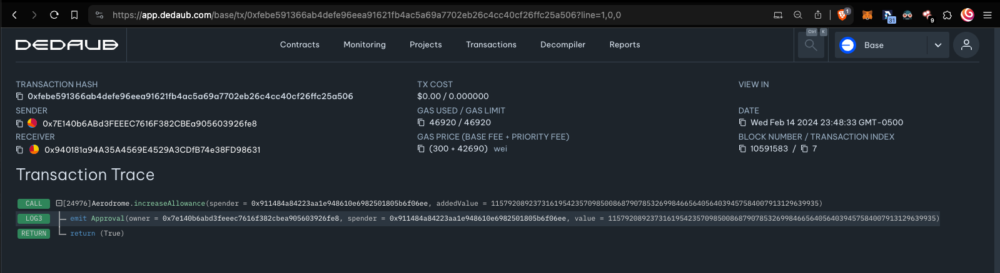
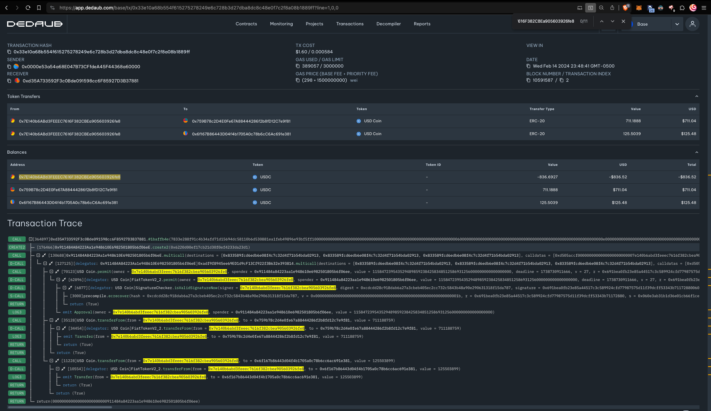
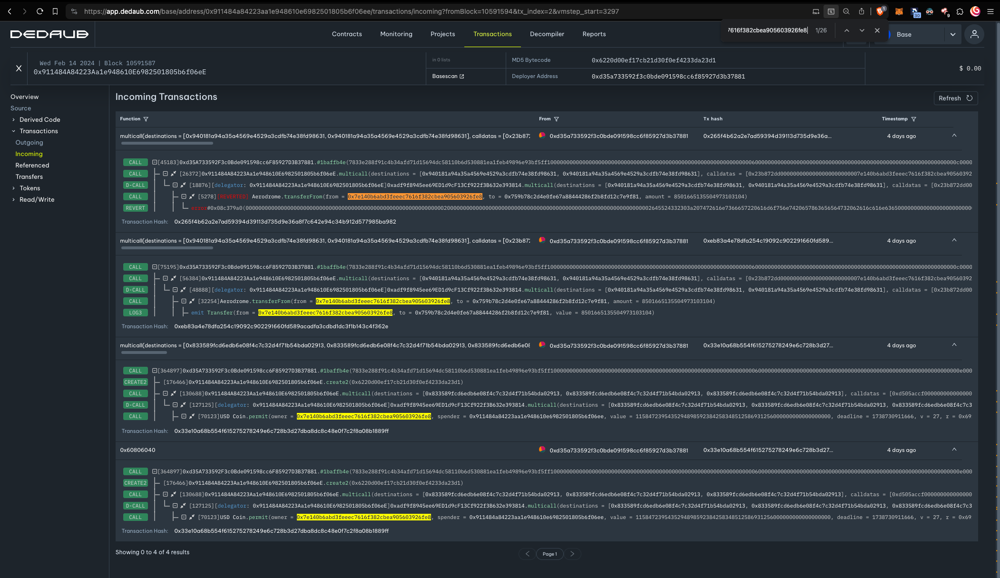
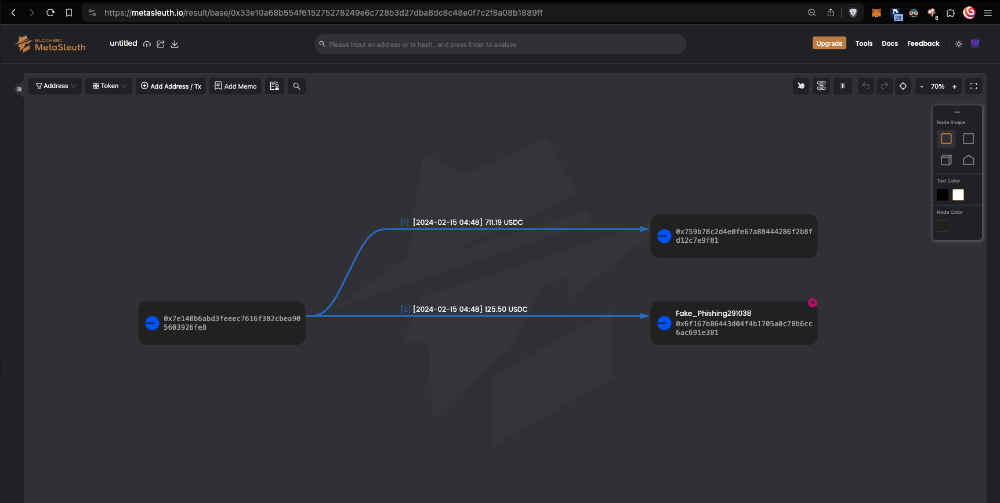
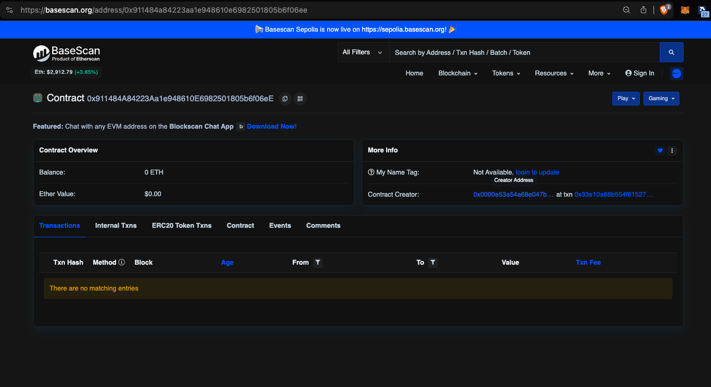

# Base Network Increase Allowance Phishing

## Details

- victim: `0x7e140b6abd3feeec7616f382cbea905603926fe8`
- malicious contract: `0x911484a84223aa1e948610e6982501805b6f06ee`
- deployer address: `0xd35a733592f3c0bde091598cc6f85927d3b37881`
- network: base

increase allowance called by drainer contract 

https://app.dedaub.com/base/tx/0xfebe591366ab4defe96eea91621fb4ac5a69a7702eb26c4cc40cf26ffc25a506?line=1,0,0

Base Network user approvals of malicious contract both instances are referencing the spender as `0x911484A84223Aa1e948610E6982501805b6f06eE`
 - 0x33e10a68b554f615275278249e6c728b3d27dba8dc8c48e0f7c2f8a08b1889ff 
    - Assets drained in this transaction: 
        - 711.188759 ($711.09) USD Coin (USDC) to `0x759b78c2d4e0fe67a88444286f2b8fd12c7e9f81`
        - 125.503899 ($125.49) USD Coin (USDC) to `0x6f167b86443d04f4b1705a0c78b6cc6ac691e381`
        - Drain with obscure signature and Create2 
         
 - 0xfebe591366ab4defe96eea91621fb4ac5a69a7702eb26c4cc40cf26ffc25a506 

Unauthorized Transfers
https://app.dedaub.com/base/address/0x911484a84223aa1e948610e6982501805b6f06ee/transactions/incoming?fromBlock=10591594&tx_index=2&vmstep_start=3297

Contract Decompiled
https://app.dedaub.com/base/address/0x911484a84223aa1e948610e6982501805b6f06ee/decompiled

Basescan.org explorer read error, currently the basescan explorer is claiming that the deployer for the malicious contract address `0x911484a84223aa1e948610e6982501805b6f06ee` utilized to drain assets from `0x7e140b6abd3feeec7616f382cbea905603926fe8` is `0x0000e53a54a68E047B73CFfdeA45F44368a60000`.

 
 Which is somewhat misleading as the contract creator is `0xd35a733592f3c0bde091598cc6f85927d3b37881`; what is occurring in this case is a misuse of the contract Create2 function, it is allowing malicious actors to more readily mask their illicit activities and confuse users not versed in more robust transaction reading techniques. This is important to note, because when reviewing `0xd35a733592f3c0bde091598cc6f85927d3b37881` as the deployer it can be observed that 86 contracts with matching init codes have been deployed from the unit.  

  
basescan is showing 86 similar contracts to the instance: `0x911484A84223Aa1e948610E6982501805b6f06eE`

https://basescan.org/address/0x911484a84223aa1e948610e6982501805b6f06ee#code

## Conclusion

86 Contracts have been deployed by `0xd35a733592f3c0bde091598cc6f85927d3b37881` on the Base network, they can more easily be observed through this [visualization](https://metasleuth.io/result/base/0x5fd7B662800f379751697398C0c138705092547C?source=1f06afba-2200-4488-a33a-220f6921afea)
